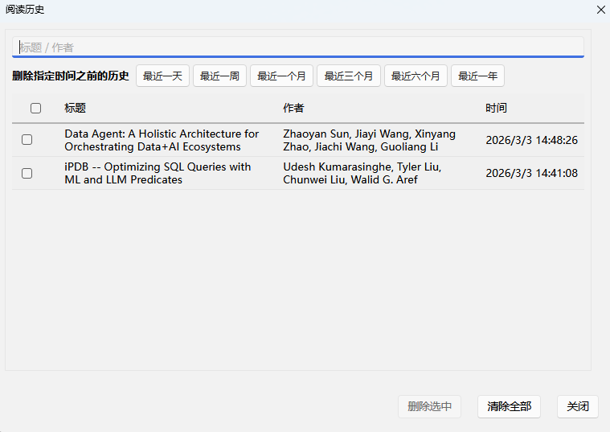

# ZoteroOfMine

[](https://www.zotero.org/)
[](LICENSE)
[](https://github.com/windingwind/zotero-plugin-template)
[](https://github.com/lovelynewlife/ZoteroOfMine/actions/workflows/ci.yml)
[](https://github.com/lovelynewlife/ZoteroOfMine/releases)

A personal Zotero 7 plugin and CLI tool for tracking and managing PDF reading history, with AI-powered research capabilities via LLM Tool Calling and CCP (Clipboard Context Protocol).

## ✨ Features

### 📋 CCP - Clipboard Context Protocol

Copy Zotero items as structured AI context via right-click menu:

- **Right-click Menu**: Select items → "Copy as AI Context" / "拷贝为AI上下文"
- **Single/Multiple Selection**: Support copying one or many items at once
- **Structured Output**: CCP JSON format with item metadata (title, authors, year, DOI, URL, key)
- **zcli Integration Hint**: Includes hint for AI clients to use zcli for deeper exploration
- **Cross-Platform**: Works with any AI client that supports clipboard input

### 📖 Zotero Plugin - Reading History Management



- **Left Sidebar Integration**: Quick access via "Reading History" button at the bottom of the left sidebar
- **Rich Information Display**: Shows document title, authors, year, DOI, and capture timestamp
- **One-Click Open**: Double-click any history entry to open the corresponding document

### 🔍 Smart Search & Filter

- **Real-time Search**: Filter history by document title or authors
- **Sortable Columns**: Click column headers to sort by title, authors, year, or time
- **Pagination**: Navigate through large history datasets efficiently

### 🗑️ Flexible Deletion Options

- **Bulk Deletion**: Select multiple entries using checkboxes and delete them together
- **Time-Based Deletion**: Delete history from specific time periods:
  - Last day, week, month, 3 months, 6 months, year
- **Clear All**: Remove all history with a confirmation prompt

### 🖥️ zcli - Command Line Interface

A standalone CLI tool for querying your local Zotero database. Designed for LLM Tool Calling integration with AI assistants like Cherry Studio, Cursor, Claude Desktop, etc.

**Key Features:**
- 🚀 **Zero Dependencies**: Pure local SQLite access, no API keys required
- 🔍 **Full-Text Search**: Search by title, authors, abstract
- 📚 **Collection & Tag Management**: List all collections and tags
- 📄 **PDF Path Resolution**: Get full PDF file paths for attachments
- 🤖 **LLM Ready**: JSON output format, perfect for Tool Calling

---

## 📦 Installation

### Zotero Plugin

#### From Release (Recommended)

1. Download the latest `zoteroofmine.xpi` from the [Releases](https://github.com/lovelynewlife/ZoteroOfMine/releases) page
2. Open Zotero 7
3. Go to `Tools` → `Add-ons`
4. Click the gear icon → `Install Add-on From File`
5. Select the downloaded `.xpi` file

#### From Source

```bash
git clone https://github.com/lovelynewlife/ZoteroOfMine.git
cd ZoteroOfMine
pnpm install
pnpm run build
# Plugin: build/zoteroofmine.xpi
```

### zcli CLI Tool

CLI installation, usage, and release distribution are maintained in:

- [cli/README.md](cli/README.md)

MCP quick start for Codex:

```bash
cd cli
pip install -e ".[mcp]"
codex mcp add zcli -- zcli-mcp
```

---

## 🤖 Codex Skill Distribution

### zcli Tool Calling

The repo ships a ready-to-distribute Codex skill for `zcli` tool calling:

- `skills/zcli-tool-calling/`
- `skills/zcli-tool-calling/SKILL.md`
- `skills/zcli-tool-calling/agents/openai.yaml`
- `skills/zcli-tool-calling/references/`

Distribution steps:
1. Copy `skills/zcli-tool-calling` to the target machine's Codex skills directory.
2. Use `CODEX_HOME/skills` if `CODEX_HOME` is set; otherwise use `~/.codex/skills`.
3. Restart Codex to re-index skills.

Example:
```bash
cp -R skills/zcli-tool-calling "${CODEX_HOME:-$HOME/.codex}/skills/"
```

### CCP Context Protocol

A distributable skill for AI clients to detect and parse CCP-formatted clipboard content:

- `skills/ccp-context-protocol/`
- `skills/ccp-context-protocol/SKILL.md`
- `skills/ccp-context-protocol/agents/openai.yaml`
- `skills/ccp-context-protocol/references/ccp-zcli-integration.md`

This skill enables AI clients to:
- Detect CCP-formatted clipboard content automatically
- Parse structured context from Zotero items
- Integrate with zcli for deeper exploration

Distribution:
```bash
cp -R skills/ccp-context-protocol "${CODEX_HOME:-$HOME/.codex}/skills/"
```

---

## 🚀 Usage

### Zotero Plugin

#### Copying as AI Context (CCP)

1. Select one or multiple items in Zotero
2. Right-click → "Copy as AI Context" / "拷贝为AI上下文"
3. Paste into your AI client (Cherry Studio, Cursor, Claude, etc.)
4. The AI client will receive structured context with item metadata

**Example CCP Output:**
```json
{
  "ccp": "1.0",
  "source": "zotero",
  "item": {
    "key": "XQRMYQUN",
    "title": "Attention Is All You Need",
    "authors": ["Vaswani, A.", "Shazeer, N."],
    "year": "2017",
    "doi": "10.48550/arXiv.1706.03762",
    "url": "https://arxiv.org/abs/1706.03762"
  },
  "hint": "You can use zcli commands..."
}
```

#### Viewing History

1. Click the "Reading History" / "阅读历史" button at the bottom left of Zotero
2. The history dialog will show all tracked reading sessions

#### Opening Documents

Double-click any row in the history table to open the corresponding document.

#### Deleting History

- **Selected Items**: Check boxes → "Delete Selected"
- **Time Period**: Click time button (e.g., "Last Week")
- **All**: Click "Clear All"

### zcli CLI Tool

For zcli commands, configuration, and MCP integration details, see:

- [cli/README.md](cli/README.md)

---

## 🔧 Development

### Prerequisites

- Node.js 18+
- Python 3.10+
- pnpm

### Setup

```bash
# Clone
git clone https://github.com/lovelynewlife/ZoteroOfMine.git
cd ZoteroOfMine

# Plugin development
pnpm install
pnpm run start-watch    # Hot-reload mode

# CLI development
cd cli
pip install -e ".[dev]"
pytest tests/ -v        # Run tests
```

### Project Structure

```
ZoteroOfMine/
├── addon/                    # Plugin resources
│   ├── assets/              # Icons
│   ├── locale/              # i18n (en-US, zh-CN)
│   └── chrome/              # UI styles & icons
├── src/
│   ├── modules/
│   │   ├── historyStore.ts        # Storage layer
│   │   ├── readingHistory.ts      # History UI
│   │   └── ccpProducer.ts         # CCP context producer
│   └── utils/
│       └── zdb.ts           # Zotero DB helpers
├── cli/                      # zcli CLI tool
│   ├── Makefile              # CLI/MCP build targets
│   ├── entrypoint.py         # PyInstaller entrypoint (zcli)
│   ├── entrypoint_mcp.py     # PyInstaller entrypoint (zcli-mcp)
│   ├── src/zotero_cli/
│   │   ├── main.py          # CLI entry point
│   │   ├── commands.py      # Command handlers
│   │   ├── database.py      # SQLite queries
│   │   ├── config.py        # Configuration
│   │   ├── models.py        # Data models
│   │   └── mcp_server.py    # MCP server for Codex/tool calling
│   ├── tests/               # pytest tests
│   └── pyproject.toml
├── skills/                   # Distributable Codex skills
│   ├── zcli-tool-calling/   # zcli tool calling skill
│   └── ccp-context-protocol/ # CCP parsing skill
├── .github/workflows/        # CI/CD
└── package.json
```

### Building

```bash
# Build plugin
pnpm run build
# → build/zoteroofmine.xpi

# Build CLI binary (default: onedir mode, faster startup)
cd cli && make build
# → dist/zcli/zcli (onedir mode)
# → dist/zcli (onefile mode, if PYINSTALLER_MODE=onefile)
```

### Testing

```bash
# Plugin (TypeScript)
pnpm run tsc

# CLI (Python)
cd cli && pytest tests/ -v
```

---

## 💾 Data Storage

### Plugin Data

Reading history is stored in:
```
{Zotero Profile}/zoteroofmine_history.json
```

### CLI Config

Configuration stored in:
```
~/.zcli/config.json
```

---

## 🛠️ Tech Stack

- **Plugin**: TypeScript, zotero-plugin-toolkit, zotero-types
- **CLI**: Python 3.10+, Typer, PyInstaller
- **Database**: SQLite (Zotero's zotero.sqlite)

---

## 🤝 Contributing

Contributions welcome! Please submit a Pull Request.

## 📄 License

AGPL-3.0-or-later - see [LICENSE](LICENSE) for details.

## 🙏 Acknowledgments

- [zotero-plugin-template](https://github.com/windingwind/zotero-plugin-template) by windingwind
- [Zotero](https://github.com/zotero/zotero) - The amazing reference manager

## 📧 Support

- [GitHub Issues](https://github.com/lovelynewlife/ZoteroOfMine/issues)
